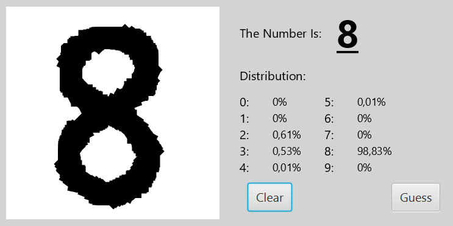

# NumberClassifier
A Java implementation of a neural network which can predict hand drawn numbers from 0 to 9 wraped in an easy to use GUI. The application continually makes predictions about the number you are drawing so you can follow the "thought"-process of the neural network. 

The neural network is trained on the MNIST dataset, which can be downloaded [here](https://pjreddie.com/projects/mnist-in-csv/). If you wish to train a new neural network, place the datasets into a new folder called mnist or alter the file names in the loadData function in NNTrainer.java.

# What i have learned
- How to implement neural networks and the math behind it.
- How to preprocess image data.
- How to convert pixel data from a canvas into a matrix.

# What the GUI looks like

